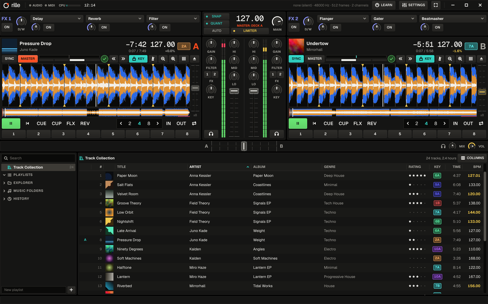

<p align="center">
  
</p>
<h1 align="center">rille</h1>
<p align="center"><b>dj software for linux</b> · four decks, remix decks, beat-locked sync<br>
<a href="#installing">Install</a> · <a href="#using-it">Manual</a></p>



rille (German for the groove in a record) is a native Linux DJ application:
four decks, remix decks, a mixer with FX, a music library and MIDI/HID
controller support, built around one priority — **beatgrids that are detected
automatically and precisely enough that sync never drifts.**

## What it does

- **Automatic beatgrids.** Every track is analyzed once (about 2 s per track):
  exact tempo, bar start, key, loudness and a spectral waveform. Grid lines
  sit on the start of the kick, measured from the average of all beats, and
  every beat is timed against that average so the tempo comes out exact
  (144.000, not 144.002). Grids are constant for produced music, piecewise
  when the tempo changes, and a per-beat map for live-played music. Only
  real doubts are flagged in the deck ("check tempo", "check bar start").
  **TICK** on a deck plays a click on every beat (higher on bar 1), so a
  grid can be checked by ear.
- **Beat-locked sync.** Synced decks follow the beat you hear from the master
  deck, not a BPM number, so the phase cannot drift — with or without keylock,
  through loops, hotcue jumps, seeks and scratches of either deck. After a
  jump the follower lands in phase at once (crossfaded), never by seconds of
  tempo pulling. Nudging a synced deck pushes it only while held.
  Half/double-time tracks sync at their natural tempo.
- **Decks:** play, CUE / CUP, 8 hotcues (cue or loop), auto loops 1/32–32
  beats, loop in/out, beatjump, flux mode, reverse, keylock (high-quality time
  stretching), key shift, tempo fader (±2–100 %), pitch bend, scratching on the
  waveform or a jog wheel, quantize and snap.
- **Remix decks:** any deck can be one (Settings → Decks). Four slots of 16
  sample cells each — loops and one-shots, loaded from the library or captured
  from a playing track deck's loop — started in time with the deck (quantized
  to 1/4 beat … 2 bars), with per-slot volume, filter, mute and stop. The deck
  syncs like a track deck; its cells are saved and come back on the next start.
- **Mixer:** gain with auto-gain (loudness levelling), 3-band isolator EQ with
  full kill, DJ filter, channel faders, crossfader, headphone cue with mix and
  volume, master limiter, meters.
- **FX:** two units with three slots each — delay, reverb, LFO filter, flanger,
  gater and beatmasher, all tempo-synced.
- **Library:** scans your music folders, reads tags and cover art, search,
  sorting, star ratings, color tags, playlists, play history, and import of a
  Traktor `collection.nml` (your corrected grids, cues, loops and ratings).
  Optional track suggestions (Settings → Library) list what fits the
  playing track by tempo, key and genre.
- **File explorer:** browse any folder, drive or USB stick in the browser,
  load files straight onto a deck, import and analyze folders (with
  subfolders) or add them as music folders. Analysis runs in the background
  with priorities (loaded decks first, then what you asked for, then the rest
  of the collection); progress, pause and cancel are in the status bar, and
  files that cannot be analyzed are not retried.
- **Controllers:** MIDI mappings (bundled: Pioneer DDJ-400, Hercules DJControl
  Inpulse 200, Allen & Heath Xone:K2 as a 4-deck controller, and a documented
  generic template), the Native Instruments Traktor Kontrol Z1, X1 MK2 and F1
  (remix decks, RGB pads) over HID, MIDI learn, soft takeover, jog wheels, LED
  feedback, hotplug.
- **Audio:** PipeWire natively, JACK, or ALSA. Headphone cue on outputs 3/4 of
  a 4-channel interface, or split mono on 2 channels. External mixer mode for
  hardware mixers such as the Allen & Heath Xone:96: every deck on its own
  mixer channel.

## Accuracy

Measured, not assumed:

| Test | Result |
|---|---|
| Synthetic tracks, 8 tempos (95–174 BPM, incl. 126.37 and 133.33) at 44.1/48/96 kHz | exact BPM, every beat within 0.37 ms, correct downbeat |
| Synthetic breakdown (16 bars without kick) / tempo change / live drift | exact / piecewise grid within 2 ms / follows the drummer within 4 ms (p95) |
| 1,142 real electronic tracks | 1,132 constant grids, 10 variable; every beat within 2 ms of the grid (p95) on 872 tracks, median p95 0.49 ms; BPM equal to Mixxx's analysis on 251 of 264 shared tracks |
| Keys vs. Beatport tags (390 tracks) | 56 % exact, 72 % harmonically compatible |
| Sync on rendered audio, 60 s, 124 vs 128 BPM | worst phase error 0.016 ms (varispeed), 0.41 ms (keylock) |
| Loops | 125 wraps, every interval exact to one sample, with and without keylock |
| Sync torture test: 40 random seeks, jumps, loops, scratches, nudges, keylock and master changes per run | every follower click within 1 ms of the master's 200 ms after each operation (30 seeds) |

Run `rille-cli eval <folders> [--mixxx ~/.var/app/org.mixxx.Mixxx/.mixxx/mixxxdb.sqlite]`
to measure your own library, `rille-cli gridplot <out-dir> <files>` to see every
beat of a track stacked against its grid lines, and `rille-cli click <out-dir>
<files>` to write copies with a click on every beat.

## Installing

Requirements: Rust (stable), Qt 6.5+ (`qt6-base`, `qt6-declarative`), a C++
compiler and `clang` (for bindings), PipeWire or JACK or ALSA development files.

```sh
./scripts/install.sh            # builds and installs into ~/.local
rille
```

Other options: `packaging/arch/PKGBUILD` (`makepkg -si` in that folder),
`packaging/flatpak/io.github.birkmann.rille.yml`, `packaging/appimage/build-appimage.sh`.

## Using it

1. On first start the settings open: add your music folder under **Library**.
   Tracks are scanned and analyzed in the background.
2. Drag a track onto a deck (or double-click it, or use the **A**/**B** buttons
   that appear when hovering a row). Files can also be dropped from the file
   manager, or opened under **Explorer** in the browser. Right-click rows or
   folders for analysis, import, colors and playlists; Ctrl/Shift-click
   selects several rows. **S / M / L** next to COLUMNS switches between
   compact rows and taller rows with larger cover art.
3. Press **SYNC** on the deck you bring in: it plays in tempo and in phase with
   the master deck.

Keyboard (while not typing in the search field):

| | Deck A | Deck B |
|---|---|---|
| Play / Cue / Sync | Z / X / C | M / N / B |
| Hotcues 1–4 | 1 2 3 4 | 7 8 9 0 |
| Beatjump back / forward | Q / W | O / P |
| Loop on/off | S | K |
| Load selected track | Shift+← | Shift+→ |

**Suggestions:** switch on "Suggest tracks" under Settings → Library and
**Suggestions** appears under Track Collection in the browser. It lists the
tracks that fit the one on air (the master deck while it plays, else the deck
that has played longest), best first: the tempo has to be within 6 % (half or
double time counts), then key (Camelot neighbours) and genre decide the order.
Tracks on the decks and those played in this session are left out, and the
list follows along as the mix moves on. The **Match** column (COLUMNS) shows
the score.

**Correcting a grid:** press **GRID** on a deck. The arrows move the grid by
10/1 ms, ×2/÷2 fix half/double tempo, BEAT HERE puts a beat on the play
position, BAR START marks the first beat of a bar, TAP sets the tempo by
tapping, the lock protects the grid from re-analysis, RESET returns to the
analyzed grid. Corrections are saved immediately.

**Controllers:** Settings → Controllers lists MIDI inputs; choose a mapping or
use **MIDI LEARN** (click a control on screen, then move the control on the
hardware). Learned mappings are saved in `~/.config/rille/mappings`. The mapping
you choose for a device is remembered for the next time it is plugged in.

Some mappings come in several deck orders. The Xone:K2 drives decks C A B D
from left to right by default, so the middle columns are decks A and B;
choose "Allen & Heath Xone:K2 (ABCD)" for A B C D. A mapping file offers this
with `deck_layouts = ["CABD", "ABCD"]`, see `mappings/allen-heath-xone-k2.toml`.
The Z1 and X1 MK2 drive decks A and B, or C and D with their "(CD)" mapping.
The F1 drives remix deck C (or D, A, B with its other mappings): the pads play
the cells of the visible page (the encoder turns pages), faders and knobs are
the slot volumes and filters, the buttons below them stop the slots. Hold
SHIFT on a pad to empty it, CAPTURE to capture a loop from the source deck
into it, TYPE to switch loop/one-shot, BROWSE to load the browser's selected
track; the full table is in `mappings/traktor-kontrol-f1.toml`.

The Z1 is also a sound card. When it is connected and no other output is
chosen (or one of its own outputs is), rille plays the main mix through its MAIN
OUT and the headphone cue through its headphone jack. Its MAIN and headphone
VOL knobs are analog and act on those outputs directly.

**External mixer (Allen & Heath Xone:96):** connect USB 1 (or USB 2) and set
the mixer's channels 1-4 to that USB input. When no output device is chosen
(or any of the Xone:96's is), rille plays through the Xone:96, and with
Settings → Audio → Mixing on Automatic every deck goes to its own channel:
C A B D on channels 1-4 by default (outputs 1/2, 3/4, 5/6, 7/8), or A B C D
under "Mixer channels". The Xone:96 then does the faders, EQ, filters,
crossfader and headphones; rille keeps GAIN, its EQ and filter (neutral unless
you turn them), key shift and the FX units, which become inserts on the
first deck assigned to them. The on-screen fader, crossfader and headphone
controls are hidden, and each channel shows the mixer channel it feeds.
Under PipeWire switch the Xone:96's card to the "Pro Audio" profile
(pavucontrol → Configuration): its stereo profile only reaches channel 1.
The Xone:96's MIDI (channel 16, sent while the MIDI 1/2 switch is lit) moves
rille's faders and crossfader, which only matters for "Dim with fader". A
Xone:K2 on its X:LINK port works through the Xone:96's USB MIDI with the
K2 mapping included in `mappings/allen-heath-xone-96.toml` (a mapping file
can pull in another with `include = ["…"]`).

The Traktor Kontrol Z1, X1 MK2 and F1 speak HID rather than MIDI. rille reads them
directly and presents them as MIDI (`crates/rille-midi/src/hid.rs`), so their
mapping files, MIDI learn and soft takeover work like any other controller's.
Opening them needs a udev rule, which the Arch package installs; otherwise
install it once:

    sudo install -m644 packaging/udev/70-rille-controllers.rules /etc/udev/rules.d/
    sudo udevadm control --reload && sudo udevadm trigger

Files: settings in `~/.config/rille`, the library in `~/.local/share/rille`,
cover thumbnails in `~/.cache/rille`. Set `RILLE_PROFILE=<dir>` to keep
everything in one folder instead (portable setups, tests).

## Architecture

| Crate | Purpose |
|---|---|
| `rille-core` | Shared types: beatgrids (constant / piecewise / live), quantize math, keys, control IDs, cues |
| `rille-decode` | Decoding for playback and analysis alike, so positions match exactly |
| `rille-analysis` | Tempo, lattice fit, transient refinement, grid classification, downbeat, key, loudness, waveform |
| `rille-dsp` | Real-time DSP: EQ, filter, limiter, meters, resampling, the six effects |
| `rille-engine` | Audio engine: decks, beat-locked sync, keylock, mixer, cpal backends |
| `rille-library` | SQLite collection, scanning, tags, covers, playlists, history, NML import |
| `rille-midi` | MIDI mappings, learn, soft takeover, jog, LED feedback, devices |
| `rille-app` | Application core without UI: loading, background analysis, persistence |
| `rille-ui` | Qt Quick interface and the `rille` binary |
| `rille-cli` | The `rille-cli` developer tool: `analyze`, `eval`, `gridplot`, `click`, `play`, `chroma-dump` |

The audio thread never allocates, locks or waits: commands arrive through a
lock-free queue, state goes out through a triple buffer, and memory it no longer
needs is freed on the app side.

## Development

```sh
cargo test --workspace --release    # all tests incl. the beatgrid accuracy suite
cargo clippy --workspace --all-targets -- -D warnings
./scripts/qmllint.sh release        # after building rille-ui
QT_QPA_PLATFORM=offscreen QT_FATAL_WARNINGS=1 ./target/debug/rille --smoke-test
QT_QPA_PLATFORM=offscreen ./target/release/rille --screenshot=/tmp/rille.png --load=A:song.mp3 --play=A
QT_QPA_PLATFORM=offscreen ./target/release/rille --screenshot=/tmp/rille.png --browse=~/Music   # explorer
RILLE_PROFILE=<dir> QT_QPA_PLATFORM=offscreen ./target/release/rille --scan --delay=60 --screenshot=/tmp/rille.png   # scan + analyze a prepared library first
RILLE_TORTURE_SEEDS=30 cargo test --release -p rille-engine --test sync_torture              # long sync test
rille-cli analyze song.mp3             # grid report for one file
rille-cli play song.mp3 10             # engine on the real audio device
RILLE_TIMING=1 RILLE_DEBUG_OBS=1 rille-cli analyze song.mp3   # analysis internals
RILLE_DEBUG_DOWNBEAT=1 RILLE_DEBUG_BARS=1 rille-cli analyze song.mp3   # bar start evidence
```

## Limitations

- No stem separation or recording yet. HID controllers other than the
  Traktor Kontrol Z1, X1 MK2 and F1 are not supported.
- The bar start is found from the track's section changes (drops,
  breakdowns); on loop-based music without them, and when the kick comes back
  a beat early, it can be off by a beat. Such tracks are marked "check bar
  start"; fix them with BAR START in the grid editor.
- The bundled DDJ-400, Inpulse 200, Xone:K2, Z1, X1 MK2, F1 and AMX mappings
  were converted from Mixxx or community mappings and have not all been
  tested on the hardware; the tempo fader direction may need `invert = true`.
  The Xone:K2 must stay on its factory MIDI channel 15. The X1 MK2's segment
  displays are not driven. Xone:96 support follows its user guide and has not
  been tested on the hardware either; the PipeWire device name is assumed to
  contain "Xone:96", and the mixer must stay on MIDI channel 16.
- Flatpak and AppImage builds need network access to build and have not been
  run yet; there are no prebuilt packages.

## Website and brand

`website/` is the project site: static HTML and CSS, no build step, deployed
on Vercel with `website` as the root directory (`website/vercel.json`). The brand kit (logo,
colors, type, rules) is in `rille-brand/`; the app's colors live in
`crates/rille-ui/qml/Theme.qml`.

## Credits

Most bundled controller mappings and the HID report layouts are derived from
the [Mixxx](https://mixxx.org/) controller mappings (GPL-2.0-or-later) and
community mappings; each file in `mappings/` names its sources and authors.

## License

Copyright (C) 2026 The rille contributors

GPL-3.0-or-later. See `LICENSE`. The bundled Geist and Geist Mono fonts are
under the SIL Open Font License (`crates/rille-ui/assets/fonts/OFL.txt`).

rille is not affiliated with or endorsed by Native Instruments, Pioneer DJ,
Allen & Heath, Hercules, Akai Professional, Beatport or the Mixxx project.
Product names are trademarks of their respective owners and are used only to
identify compatible hardware and file formats.
