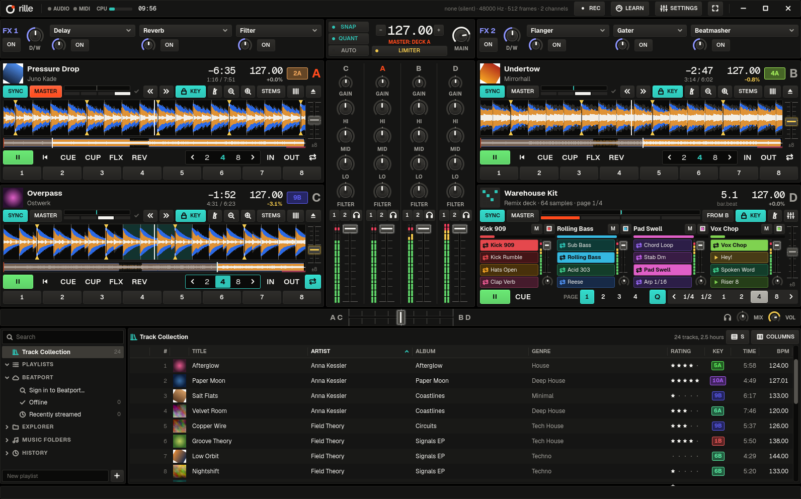

  

<h1 align="center">rille</h1>

<b>dj software for linux and macos</b> · four decks, remix decks, beat-locked sync 
<a href="#installing">Install</a> · <a href="docs/manual.md">Manual</a>

rille (German for the groove in a record) is a native DJ application for Linux and
macOS: four decks, remix decks, a mixer with FX, a music library and MIDI/HID
controller support, built around one priority — **beatgrids that are detected
automatically and precisely enough that sync never drifts.**

## What it does

- **Automatic beatgrids:** tempo, bar start, key, loudness and waveform from
  one analysis per track; only real doubts are flagged.
  [Measured accuracy](docs/development.md#accuracy).
- **Beat-locked sync:** synced decks follow the beat you hear from the master
  deck, through loops, jumps, seeks and scratches, with or without keylock.
- **Decks:** CUE / CUP, 8 hotcues, loops, beatjump, flux, reverse, keylock,
  key shift, scratching, quantize.
- **Stems:** split a track into drums, bass, other and vocals (HTDemucs).
- **Remix decks:** four slots of 16 loop and one-shot cells, in time with the deck.
- **Drum machine:** 16-step sequencer with eight tracks, your own samples and
  racks, in phase with the master. Effects on each track, a delay and reverb
  to send to, and a compressor with sidechain. [Drum machine](docs/drum-machine.md).
- **Mixer and FX:** auto-gain, 3-band EQ, filter, crossfader, headphone cue,
  limiter; two FX units with six tempo-synced effects.
- **Library:** music folders, tags, cover art, playlists, history, Traktor
  `collection.nml` import, file explorer, track suggestions, Beatport streaming.
- **Recording:** the main mix to a 24-bit WAV with a cue sheet.
- **Controllers:** bundled MIDI and HID mappings (Pioneer DDJ-400, Hercules
  Inpulse 200, Xone:K2, Traktor Kontrol Z1, X1, F1, Maschine Mikro MK2), MIDI
  learn, LED feedback. [Controllers](docs/controllers.md).
- **Audio:** PipeWire, JACK or ALSA on Linux, Core Audio on macOS; external
  mixer mode for hardware mixers such as the Xone:96.

## Installing

- **Linux:** download `rille-x86_64.AppImage` from the latest GitHub release,
  `chmod +x` it and run it.
- **macOS:** download `rille-macos-arm64.dmg` (Apple silicon, macOS 12+) and
  drag rille to Applications; allow the first launch under System Settings →
  Privacy & Security.
- **From source:** `./scripts/install.sh` (needs Rust, Qt 6.5+ and `clang`).

Menu launcher, other packages, the udev rule for controllers and uninstalling:
[docs/install.md](docs/install.md).

## Using it

1. On first start the settings open: add your music folder under **Library**.
   Tracks are analyzed in the background.
2. Drag a track onto a deck (or double-click it).
3. Press **SYNC** on the deck you bring in: it plays in tempo and in phase
   with the master deck.

Keyboard, grid correction, suggestions and Beatport are in the
[manual](docs/manual.md).

## Documentation

- [Installing](docs/install.md): AppImage, macOS, from source, udev rule, uninstalling
- [Manual](docs/manual.md): getting started, keyboard, suggestions, grids, Beatport, files
- [Drum machine](docs/drum-machine.md): sequencer, kits and racks, effects, Maschine Mikro MK2, mapping targets
- [Controllers](docs/controllers.md): mappings, MIDI learn, deck orders, Traktor Kontrol, Xone:96, HID
- [Development](docs/development.md): architecture, tests, accuracy, website

## Limitations

- Stems need the HTDemucs model (316 MB, downloaded once; research-only
  weights) and a few minutes of CPU time per track.
- On loop-based music without section changes, the bar start can be off by a
  beat; such tracks are marked "check bar start".
- Most bundled controller mappings were converted from community mappings and
  have not all been tested on the hardware; the same goes for Xone:96 support.
- No prebuilt packages until the first `v*` release; the macOS app is not
  notarized and is for Apple silicon only.
- Recording takes the internal main mix (with external mixing, record on the
  mixer) and stops when the audio output changes.
- Beatport: AAC files with their index at the end only play once that part
  has arrived; the sign-in uses
  Beatport's own web client, not an official partner integration.

## Credits

Most bundled controller mappings and the HID report layouts are derived from
existing community mappings (GPL-2.0-or-later); each file in `mappings/` names
its sources and authors.

## License

Copyright (C) 2026 The rille contributors

GPL-3.0-or-later. See `LICENSE`. The bundled Geist and Geist Mono fonts are
under the SIL Open Font License (`crates/rille-ui/assets/fonts/OFL.txt`).

rille is not affiliated with or endorsed by Native Instruments, Pioneer DJ,
Allen & Heath, Hercules, Akai Professional or Beatport.
Product names are trademarks of their respective owners and are used only to
identify compatible hardware and file formats.
