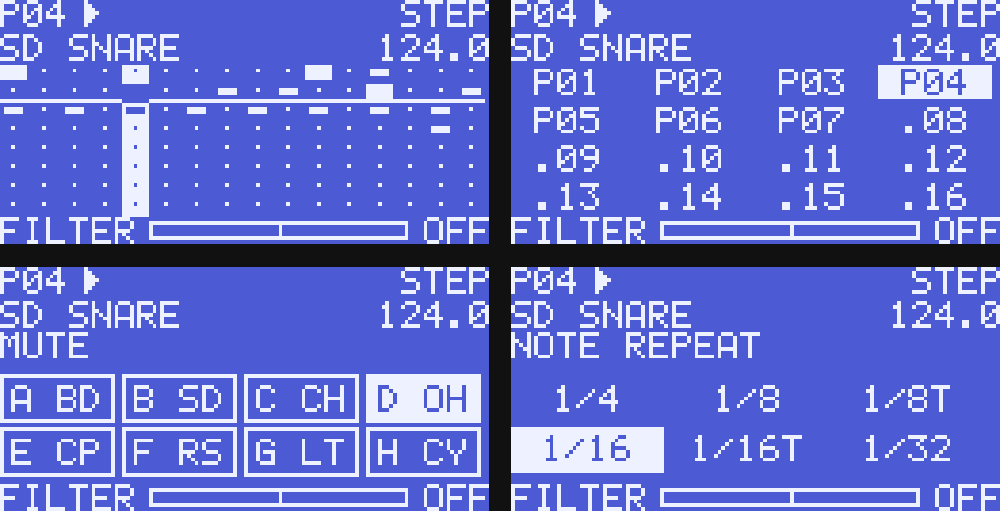

# Drum machine

- [Playing and editing](#playing-and-editing)
- [Kits and sounds](#kits-and-sounds)
- [Racks](#racks)
- [Maschine Mikro MK2](#maschine-mikro-mk2)
- [Mapping targets](#mapping-targets)

## Playing and editing

**DRUMS** in the title bar shows the drum machine (Settings → Decks: above or
below the decks, one sequencer row or four).

- The tabs choose the instrument the row and the TUNE, DECAY and LEVEL knobs
  edit; double-click a tab (or ▸) to play it, middle-click to mute it.
- Drag a tab sideways (or use "Move left/right" in its menu) to change the
  track order; the sequencer rows follow it.
- Click steps to switch them, drag to paint several, right-click (or
  Shift-click) for an accent.
- Play starts in phase with the master clock, and a pattern chosen while
  playing starts when the current one comes round.
- With **REC** on, instruments you play while it runs are written to the
  nearest step.

Patterns and settings are saved as you go, in
`~/.local/share/rille/drums/state.toml`.

## Kits and sounds

- Drop a track or file on an instrument's tab (or "Load a sound") to replace
  that sound. When the current kit is a factory kit, a kit of your own is made
  first.
- Several files dropped on a tab go to that track and the ones after it.
- "Load sounds" in the drum machine's menu takes several files at once and
  puts each on the track its name suggests (`Kick 02.wav` on BD, `Hi-Hat
  Open.wav` on OH), the others on the free tracks from the left.
- "Sounds" lists what each track plays.
- Samples longer than 8 seconds are cut.

Your own kits live in `~/.local/share/rille/drums/kits/<kit name>/`. To make
one by hand, put samples named after the instruments in a folder there
(`BD.wav` or `kick.wav`, `SD`/`snare`, `CH`/`hihat`, `OH`/`openhat`,
`CP`/`clap`, `RS`/`rim`, `LT`/`tom`, `CY`/`cymbal`; WAV, FLAC, MP3, OGG,
AIFF), or name the files in a `kit.toml` (`[samples]` with
`BD = "my kick.wav"`).

## Effects

Each instrument has its own effects, and the drums share send and master
effects, in this order:

1. **Inserts** on each instrument: bit reduction, sample-rate reduction,
   overdrive, then a resonant low-, band- or high-pass filter. Then the
   instrument's level.
2. **Sends**: each instrument sends to the drums' delay (in time with the
   master clock) and reverb. Their output joins the mix.
3. **Master**: a compressor on all the drums, then an overdrive. The
   compressor listens to all the drums or to one instrument. With BD as the
   sidechain source, the other instruments duck under the kick.
4. The drum channel: OUTPUT filter, FX1/FX2, headphones, volume fader.

The tabs above the selected instrument's knobs switch between:

| Tab | Knobs |
|---|---|
| SRC | Tune, decay, level |
| FX | Bit reduction, sample-rate reduction, overdrive |
| FILT | Cutoff, resonance, filter type |
| SEND | Delay send, reverb send |

The DRUM FX tabs switch between:

| Tab | Knobs |
|---|---|
| DLY | Delay time, feedback, filter |
| REV | Reverb size, damping, pre-delay |
| COMP | Compressor threshold, ratio, release |
| MST | Compressor sidechain source and mix, master overdrive |

- Every effect is off when its knob is at its default: inserts and sends at
  zero, the filter open, the compressor threshold fully right.
- A dot on a tab shows that something on that page is away from its default.
- Double-click a knob to reset it.

## Racks

A rack is a kit together with the track order and each instrument's tune,
decay, level, inserts and send levels. The send and master effects are not
part of a rack: they stay as they are when you switch kits.

- **Save rack** keeps them in the kit's `kit.toml` (`order`, `[names]`,
  `[sounds.BD]` …); switching to the kit brings them back.
- **Save rack as** copies everything into a new kit.
- **Export rack** writes the rack as WAV files and a `kit.toml` into a new
  folder.
- **Import rack** copies such a folder (or any folder of sounds named after
  the instruments) into your kits.

## Maschine Mikro MK2

Plugged in, it drives the drum machine and opens it; it works next to any DJ
controller. The pads, button lights, the RGB pads and the display are mapped.
The display is drawn by rille: pattern, transport, the selected instrument,
tempo, all eight instruments' steps with the playhead and what the encoder
edits; while a button is held it shows what the pads do. On Linux it needs the
[udev rule](install.md#controllers-udev-rule).

Steps, patterns, lengths and kits count from the top-left pad, row by row; the
instruments are the top two rows, A–H as printed (BD SD CH OH / CP RS LT CY).

| On the Mikro | Does |
|---|---|
| Pads | Steps 1–16 of the selected instrument; a hard hit sets an accent |
| PAD MODE | Top two rows play the instruments with velocity (recorded while REC is on), bottom two rows mute them; again: back to steps (also SHIFT+GROUP, STEP MODE) |
| GROUP or SELECT + pad | Select the instrument |
| MUTE / SOLO + pad | Mute / solo the instrument; SHIFT+MUTE (CHOKE): closed hi-hat cuts the open one |
| ERASE + pad | Clear the instrument's steps; SHIFT+ERASE clears the pattern |
| PATTERN + pad | Pattern 1–16, from the next bar while playing (tap PATTERN to keep it up) |
| DUPLICATE + pad | Copy the pattern there |
| GRID + pad | Pattern length 1–16 |
| SCENE + pad | Kit 1–16 (BROWSE + encoder: next or previous kit) |
| NOTE REPEAT + pad | Rolls in time while held; the encoder sets 1/4 … 1/32 (tap NOTE REPEAT to keep it on) |
| SAMPLING + pad | The track selected in the library as the instrument's sound; a tap on SAMPLING: drums in the headphones |
| SHIFT + pad | As printed: UNDO, REDO, QUANTIZE (no swing), QUANT 50% (half swing), NUDGE ◄ ►, CLEAR, CLR AUTO (the pattern), COPY, PASTE, SEMITONE − +, OCTAVE − + |
| PLAY · RESTART | Start/stop; start on the next downbeat or stop at the end of the bar |
| REC | Live recording; SHIFT+REC (COUNT-IN) from the next downbeat; ERASE+REC (REPLACE) a new take clears the instrument's old steps |
| ◄ STEP ► · ◄ ► | Previous/next pattern · previous/next instrument |
| Encoder | F1 level, F2 tune, F3 decay (the selected instrument), CONTROL filter, MAIN volume; SHIFT+turn swing; push: back to the default |
| VIEW · NAV | Show/hide the drum machine · drums through FX 1 (SHIFT: FX 2) |

The mapping file is generated by `scripts/gen-maschine-mikro-mk2.py`; change
the script and run it again rather than editing the file.

## Mapping targets

For mapping files and MIDI learn (see [Controllers](controllers.md)).

| Target | Does |
|---|---|
| `drum.play`, `drum.record` | Start/stop, live recording |
| `drum.play_bar`, `drum.count_in`, `drum.replace` | Start on the next downbeat or stop at the end of the bar; record from the next downbeat; replace recording |
| `drum.step.1`-`16`, `drum.accent.1`-`16` | Steps and accents of the selected instrument |
| `drum.cell.1`-`128`, `drum.cell_accent.1`-`128` | Steps and accents of any instrument: `instrument × 16 + step` |
| `drum.inst.1`-`8` | Select the instrument |
| `drum.inst_select` | Previous/next instrument (relative) |
| `drum.trigger.1`-`8` | Play the instrument |
| `drum.inst_mute.1`-`8`, `drum.inst_solo.1`-`8`, `drum.inst_clear.1`-`8` | Mute, solo, clear the instrument's steps |
| `drum.inst_level.1`-`8`, `drum.inst_tune.1`-`8`, `drum.inst_decay.1`-`8` | Level, tune, decay of the instrument |
| `drum.sel_level`, `drum.sel_tune`, `drum.sel_decay` | Level, tune, decay of the selected instrument |
| `drum.inst_bits.1`-`8`, `drum.inst_srr.1`-`8`, `drum.inst_drive.1`-`8` | Bit reduction, sample-rate reduction, overdrive of the instrument |
| `drum.inst_cutoff.1`-`8`, `drum.inst_res.1`-`8`, `drum.inst_ftype.1`-`8` | Filter cutoff, resonance, type (low-, band-, high-pass) of the instrument |
| `drum.inst_delay.1`-`8`, `drum.inst_reverb.1`-`8` | Delay and reverb send of the instrument |
| `drum.sel_bits`, `drum.sel_srr`, `drum.sel_drive`, `drum.sel_cutoff`, `drum.sel_res`, `drum.sel_ftype`, `drum.sel_delay`, `drum.sel_reverb` | The same for the selected instrument |
| `drum.delay_time`, `drum.delay_feedback`, `drum.delay_filter` | The drums' delay |
| `drum.reverb_size`, `drum.reverb_damp`, `drum.reverb_predelay` | The drums' reverb |
| `drum.comp_threshold`, `drum.comp_ratio`, `drum.comp_release`, `drum.comp_mix` | The drums' compressor |
| `drum.comp_sidechain` | What the compressor listens to: all the drums (left), then BD … CY |
| `drum.drive` | Overdrive on all the drums |
| `drum.repeat.1`-`8`, `drum.repeat_rate` | Note repeat (held: rolls), its rate |
| `drum.pattern.1`-`16`, `drum.pattern_select` | Choose a pattern; previous/next pattern |
| `drum.pattern_copy.1`-`16` | Copy the pattern there |
| `drum.length` (relative), `drum.length_set.1`-`16` | Pattern length |
| `drum.swing`, `drum.nudge` (relative) | Swing; move the selected instrument's steps |
| `drum.clear`, `drum.clear_pattern` | Clear the selected instrument's steps; clear the pattern |
| `drum.undo`, `drum.redo`, `drum.copy`, `drum.paste` | Undo, redo, copy and paste the pattern |
| `drum.kit.1`-`16`, `drum.kit_select` | Choose a kit; previous/next kit |
| `drum.load_selected.1`-`8` | The library's selected track as the instrument's sound |
| `drum.level`, `drum.filter`, `drum.fx_assign.1`-`2`, `drum.pfl` | The drum channel: volume, filter, FX units, headphones |
| `drum.choke` | Closed hi-hat cuts the open one |
| `drum.show` | Show/hide the drum machine |

Pads mapped with `mode = "velocity"` play at the velocity of the hit, and a
hard hit records or sets an accent.

For LEDs, `drum.step.N` lights the steps that are on with the playhead running
across them; `drum.step_led.N`, `drum.inst_led.N`, `drum.trigger_led.N`,
`drum.mute_led.N`, `drum.pattern_led.N`, `drum.length_led.N`,
`drum.kit_led.N` and `drum.sel_led` give RGB pad colors and `drum.meter` the
level.
